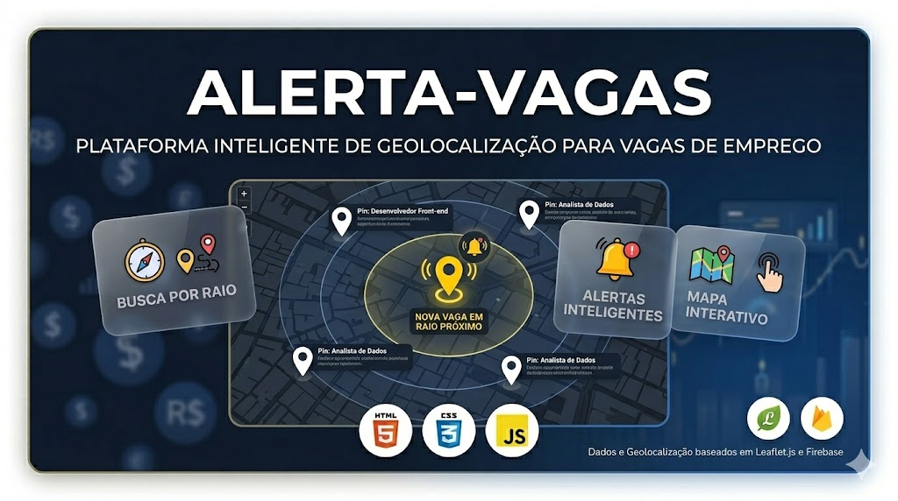

 #📍 Alerta-Vagas

> 🌐 **Acesse o projeto aqui:** [https://brendowjanuzzi-ui.github.io/alerta-vagas/](https://brendowjanuzzi-ui.github.io/alerta-vagas/)

Uma plataforma inteligente de busca de empregos baseada em geolocalização, conectando candidatos a oportunidades locais em tempo real.

## 🚀 Diferenciais do Projeto
- **Busca por Raio**: Definição de distância máxima para encontrar vagas próximas de casa.
- **Mapa Interativo**: Integração com a biblioteca **Leaflet** para visualização precisa.
- **Alertas Inteligentes**: Notificações baseadas na localização do usuário.
- **Filtros Personalizados**: Segmentação por área de atuação e tipo de vaga.

## 🛠 Stack Técnica
- **Front-end**: HTML5, CSS3 e JavaScript Moderno.
- **Mapas**: Leaflet.js para renderização de pins e raios de busca.
- **Backend/Database**: Firebase para gerenciamento de dados e autenticação.

## 🧠 Objetivo do Projeto
Reduzir o tempo de deslocamento dos trabalhadores e facilitar a conexão entre pequenas empresas locais e talentos da região, utilizando tecnologia de mapas para otimizar a busca por emprego.
